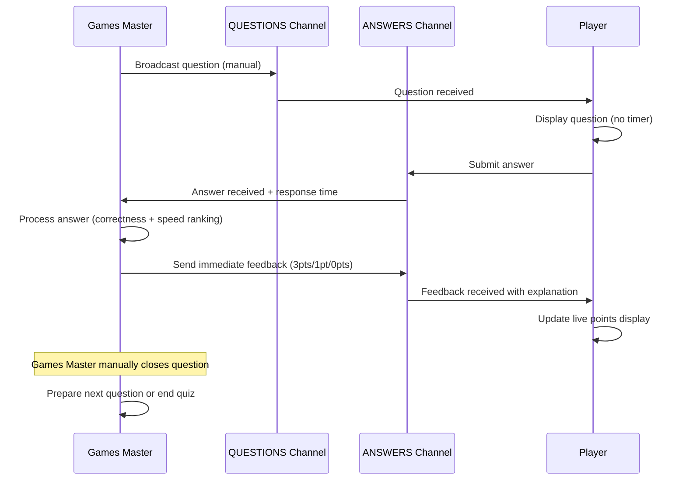
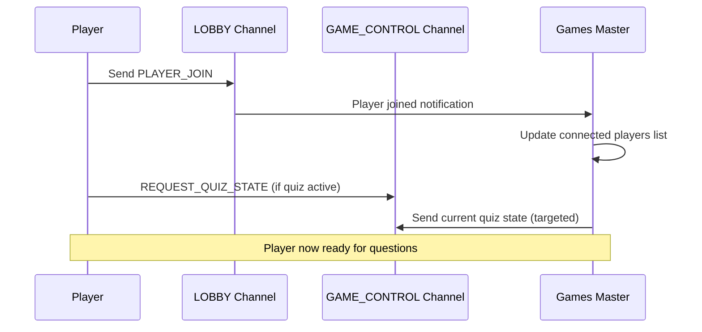
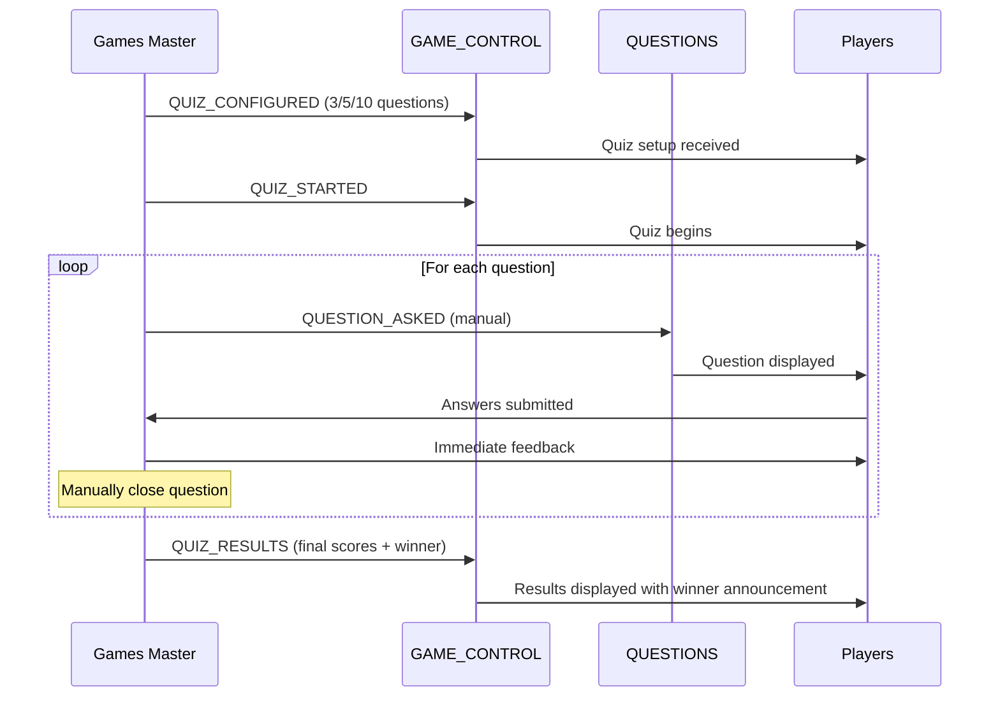

# 🎮 Multi-Choice Quiz - Real-time Trivia Game

A sophisticated real-time multiplayer trivia quiz built with React, Vite, and PubNub. Features manual question control, points-based scoring, live player management, and comprehensive final results with winner announcements.

## 🚀 Quick Start

### 1. Install Dependencies
```bash
npm install
```

### 2. Configure PubNub
Create a `.env` file with your PubNub keys:
```env
VITE_PUBNUB_PUBLISH_KEY=your-publish-key-here
VITE_PUBNUB_SUBSCRIBE_KEY=your-subscribe-key-here
```

Or use the setup script:
```bash
./setup-pubnub.sh
```

### 3. Start the Development Server
```bash
npm run dev
```

### 4. Play the Game
1. **Games Master**: Open http://localhost:5173/admin in one browser tab/window
2. **Players**: Open http://localhost:5173 in other browser tabs/windows
3. Players enter their names and join the lobby
4. Games Master configures quiz (3, 5, or 10 questions) and launches automatically
5. Games Master asks questions manually, players answer in real-time
6. Enjoy instant feedback and comprehensive final results with winner announcement!

## ✨ Game Features

### 🎮 **Games Master (Admin) Mode** (`/admin`)
- **Flexible Quiz Configuration**: Choose 3, 5, or 10 questions per quiz
- **Automatic Launch**: Quiz starts immediately upon question count selection
- **Manual Question Control**: Ask questions one by one at your own pace (no timers)
- **Live Player Monitoring**: See connected players in real-time
- **Instant Answer Tracking**: View all player responses and response times
- **Smart Question Selection**: Random questions without repeats within the same quiz
- **Comprehensive Results Dashboard**: Detailed question-by-question breakdown
- **Winner Announcement**: Automatic winner declaration with points summary
- **Mid-Quiz Management**: Handle players joining ongoing quizzes
- **Simple UI**: Clean interface with "Ask Question", "Close Question", "Next Question", "Stop Quiz" controls

### 👥 **Player Mode** (`/`)
- **Easy Join Process**: Enter name and join lobby instantly
- **Real-time Questions**: Receive questions as they're asked (3 multiple choice options)
- **Instant Response**: Submit answers with one click
- **Live Feedback**: Know immediately if you're correct with detailed explanations
- **Performance Tracking**: See your questions answered and total points in real-time
- **Speed Recognition**: Get special acknowledgment for being first with correct answer
- **Mid-Quiz Joining**: Join games already in progress and participate in remaining questions
- **Responsive Design**: Works perfectly on desktop, tablet, and mobile devices

### 🏆 **Scoring System**
- **Points-Based Scoring**: Clear, competitive point system
  - **3 points**: First player with correct answer
  - **1 point**: Correct answer (but not first)
  - **0 points**: Wrong answer or no answer
- **Real-time Updates**: Points calculated and displayed instantly
- **Final Leaderboard**: Complete standings with total points and questions answered
- **Detailed Breakdown**: Question-by-question performance analysis
- **Winner Recognition**: Automatic winner announcement broadcasted to all players

### 🚀 **Real-time Features**
- **Instant Communication**: All interactions happen in real-time via PubNub
- **Live Updates**: Questions, answers, and results appear simultaneously across all devices
- **Player Presence**: Games Master sees connected player count and names
- **Automatic Synchronization**: All players stay in sync regardless of when they join
- **Robust Connection**: Automatic reconnection and connection state monitoring
- **Multi-device Support**: Play from any device with internet connection
- **Cross-platform**: Works in all modern browsers

### 🎯 **Game Management**
- **Quiz States**: Waiting room → Active quiz → Results display
- **Flexible Participation**: Players can join/leave at any time
- **Question Progression**: Games Master controls when to move between questions
- **Early Termination**: Stop quiz at any point with proper results calculation
- **State Recovery**: New players get current quiz state when joining mid-game

## 📡 PubNub Channel Architecture

The application uses a sophisticated real-time communication system with **4 dedicated PubNub channels** for different aspects of the game:

### Channel Configuration

```javascript
// Channel definitions (src/config/pubnub.js)
export const CHANNELS = {
  LOBBY: 'trivia-lobby',
  QUESTIONS: 'trivia-questions', 
  ANSWERS: 'trivia-answers',
  GAME_CONTROL: 'trivia-game-control'
};
```

### 🏢 **LOBBY Channel** (`trivia-lobby`)
**Purpose**: Player presence management and lobby operations

**Subscribers**: 
- Games Master (monitors connected players)
- All Players (establish initial connection)

**Message Types**:
- `PLAYER_JOIN`: When a player joins the game
- `PLAYER_LEAVE`: When a player disconnects

**Message Flow**:
```
Player → LOBBY → Games Master
  ↓
✅ Player appears in Games Master's "Connected Players" list
```

**Example Message**:
```javascript
{
  type: 'player_join',
  playerUuid: 'quiz-user-abc123',
  playerName: 'Alice',
  timestamp: 1699123456789
}
```

### ❓ **QUESTIONS Channel** (`trivia-questions`)
**Purpose**: Question delivery from Games Master to all players

**Publishers**: Games Master only
**Subscribers**: All Players

**Message Types**:
- `QUESTION_ASKED`: Broadcasts new trivia questions (manually controlled)

**Message Flow**:
```
Games Master → QUESTIONS → All Players
  ↓
✅ Question appears simultaneously on all player screens
✅ Players can answer at their own pace
✅ Games Master manually closes questions
```

**Example Message**:
```javascript
{
  type: 'question_asked',
  question: {
    id: 15,
    question: "What was Netflix's first original series, released in 2012?",
    options: ["House of Cards", "Lilyhammer", "Orange is the New Black"]
  },
  quizId: 'quiz-1699123456789',
  questionNumber: 1,
  totalQuestions: 5,
  targetPlayer: null  // null for broadcast, specific UUID for targeted delivery
}
```

### 💭 **ANSWERS Channel** (`trivia-answers`)
**Purpose**: Bidirectional answer submission and feedback

**Publishers**: 
- Players (submit answers)
- Games Master (send feedback)

**Subscribers**:
- Games Master (receives all answers)
- Players (receive their personal feedback)

**Message Types**:
- `ANSWER_SUBMITTED`: Player submits their answer
- `ANSWER_RESULT`: Games Master sends feedback to specific player

**Message Flow**:
```
Player → ANSWERS → Games Master
  ↓
Games Master processes answer
  ↓
Games Master → ANSWERS → Specific Player
  ↓
✅ Player receives instant feedback with explanation
```

**Answer Submission Example**:
```javascript
{
  type: 'answer_submitted',
  playerUuid: 'quiz-user-abc123',
  playerName: 'Alice',
  questionId: 1,
  answerIndex: 1,
  answeredAt: 1699123470000,
  questionAskedAt: 1699123456789,
  responseTime: 13.211  // seconds
}
```

**Feedback Example**:
```javascript
{
  type: 'answer_result',
  playerUuid: 'quiz-user-abc123',
  isCorrect: true,
  wasFastest: true,
  feedback: "Right, and fastest!",
  explanation: "Detailed explanation here...",
  responseTime: "13.21",
  questionId: 1
}
```

### 🎮 **GAME_CONTROL Channel** (`trivia-game-control`)
**Purpose**: Game state management and control commands

**Publishers**: 
- Games Master (quiz management)
- Players (state requests)

**Subscribers**: All Players + Games Master

**Message Types**:
- `QUIZ_CONFIGURED`: Quiz setup with question count
- `QUIZ_STARTED`: Begin a new quiz session
- `QUIZ_RESULTS`: Final results with scores and winner
- `REQUEST_QUIZ_STATE`: Player requests current quiz state (for mid-quiz joining)

**Message Flow**:
```
Games Master → GAME_CONTROL → All Players
  ↓
✅ Players' UI updates to reflect game state changes
✅ Mid-quiz joiners get current state
```

**Quiz Configuration Example**:
```javascript
{
  type: 'quiz_configured',
  quizConfig: {
    questionCount: 5,
    quizId: 'quiz-1699123456789',
    isConfigured: true,
    isStarted: true
  }
}
```

**Final Results Example**:
```javascript
{
  type: 'quiz_results',
  results: {
    winner: { name: 'Alice', points: 9 },
    playerStats: [...],
    totalQuestions: 5
  }
}
```

## 🔄 Real-time Communication Flow

### Complete Question Cycle (Manual Control):



### Player Connection Flow:



### Quiz Lifecycle:



## 🏗️ Technical Implementation

### PubNub Context Provider
The `PubNubContext` (src/context/PubNubContext.jsx) manages:
- Connection state monitoring
- Message publishing/subscribing
- Error handling and reconnection
- Unique user ID generation

### Channel Subscription Strategy

**Games Master subscribes to**:
- `LOBBY` - Monitor player connections and departures
- `ANSWERS` - Receive all player submissions with response times
- `GAME_CONTROL` - Handle mid-quiz join requests

**Players subscribe to**:
- `LOBBY` - Initial connection establishment 
- `QUESTIONS` - Receive questions from Games Master (including targeted delivery)
- `ANSWERS` - Receive personal feedback with points and explanations
- `GAME_CONTROL` - Quiz configuration, state updates, and final results

### Message Structure
All messages include:
- `type`: Message type identifier
- `timestamp`: Unix timestamp
- `uuid`: Sender's unique identifier
- Type-specific payload data

## 🔧 Configuration

### Environment Variables
```env
VITE_PUBNUB_PUBLISH_KEY=pub-c-...    # For sending messages
VITE_PUBNUB_SUBSCRIBE_KEY=sub-c-...  # For receiving messages
VITE_PUBNUB_USER_ID=custom-id        # Optional: Custom user ID
```

### PubNub Features Used
- **Real-time Messaging**: Instant message delivery
- **Presence**: Player connection monitoring
- **Message Persistence**: Brief message history
- **Auto Network Detection**: Reconnection handling

## 🎯 Core Features Summary

- ✅ **Manual Question Control** - Games Master asks questions at their own pace
- ✅ **Points-Based Scoring** - 3 points for first correct, 1 point for other correct answers
- ✅ **Real-time Communication** - Instant updates via PubNub across all devices
- ✅ **Flexible Quiz Sizes** - Choose 3, 5, or 10 questions per quiz
- ✅ **Smart Question Selection** - Random questions without repeats per quiz
- ✅ **Mid-Quiz Joining** - Players can join ongoing quizzes and participate
- ✅ **Comprehensive Results** - Detailed breakdown with winner announcements
- ✅ **Response Time Tracking** - Accurate timing to determine fastest answers
- ✅ **Player Presence Detection** - Live lobby management and connection monitoring
- ✅ **Instant Answer Feedback** - Immediate results with detailed explanations
- ✅ **Route-Based Interface** - `/` for players, `/admin` for Games Master
- ✅ **Rich Question Database** - Curated trivia about streaming and interactive media
- ✅ **Responsive Design** - Works perfectly on all devices and screen sizes
- ✅ **Robust Connection Management** - Automatic reconnection and error handling

## 📁 Project Structure

```
multi-choice-quiz/
├── src/
│   ├── config/
│   │   └── pubnub.js              # Channel & message type definitions
│   ├── context/
│   │   └── PubNubContext.jsx      # Real-time communication provider
│   ├── components/
│   │   ├── GamesMaster.jsx        # Quiz host interface
│   │   └── Player.jsx             # Player interface
│   └── data/
│       └── triviaQuestions.json   # Question database
├── .env                           # Your PubNub keys
└── pubnub-config-template.md      # Setup instructions
```

## 🎮 How to Play

### **Games Master** (`/admin`):
1. **Set Up Quiz**: Choose 3, 5, or 10 questions - quiz starts automatically
2. **Monitor Players**: See connected players and their count in real-time
3. **Control Questions**: Manually ask questions one by one at your own pace
4. **Track Responses**: View all player answers, correctness, and response times
5. **Manage Flow**: Use "Close Question", "Next Question", or "Stop Quiz" controls
6. **Review Results**: See comprehensive final results with winner announcement

### **Players** (`/`):
1. **Join Game**: Enter your name and join the lobby instantly
2. **Wait for Questions**: See quiz configuration and wait for Games Master
3. **Answer Quickly**: Submit answers fast to earn maximum points (3 pts for first correct)
4. **Get Feedback**: Receive instant results with detailed explanations
5. **Track Progress**: Monitor your questions answered and total points live
6. **See Final Results**: View complete results with your ranking and winner

### **Scoring System**:
- **3 points**: First player with the correct answer
- **1 point**: Correct answer (but not fastest)
- **0 points**: Wrong answer or no answer
- **Winner**: Player with highest total points across all questions

## 🚀 Built With

- **React 18** - UI framework with hooks
- **React Router DOM** - Client-side routing for Games Master and Player interfaces
- **Vite** - Build tool and development server
- **PubNub** - Real-time communication platform
- **JavaScript ES6+** - Modern JavaScript features and async/await
- **CSS3** - Responsive design and animations

## 📝 License

This project is open source and available under the [MIT License](LICENSE).

---

**Happy quizzing! 🧠🎯**
